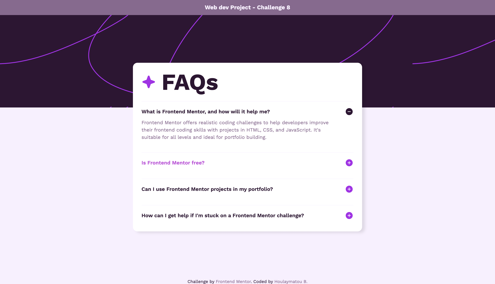

# FAQ Component

This is a solution to the **FAQ Accordion** challenge from [Frontend Mentor](https://www.frontendmentor.io).

## 🚀 Technologies Used

- HTML5
- CSS3 
- JavaScript

## 📖 Lessons Learned

In this project, I practiced:

- **DOM Manipulation**: Selecting elements, adding event listeners, and dynamically toggling classes
- **Event Handling**: Using click events to toggle the visibility of answers and changing icons
- **Responsive Design**: Ensuring the FAQ accordion looks great on all screen sizes using media queries
- **CSS Styling**: Flexbox and Grid layouts for the accordion and other components, as well as custom icon handling

---

🚀 **Thank you for checking out this project!** If you liked it, feel free to give it a ⭐ and connect with me for more web dev mini projects. Happy coding! 👩🏽‍💻

PS: Here's the [link](https://faq-accordion-component-bhb.netlify.app/) to the website live, check it out :)
